<picture>
  <source media="(max-width: 600px)" srcset="./assets/hero-mobile.svg">
  <source media="(prefers-color-scheme: dark)" srcset="./assets/hero-dark.svg">
  <source media="(prefers-color-scheme: light)" srcset="./assets/hero-light.svg">
  
</picture>

<p align="center">
  <a href="https://github.com/ptonlix">GitHub</a> ·
  <a href="https://x.com/Baird_cfd">X / Twitter</a> ·
  <a href="https://www.zhihu.com/people/baird-66">知乎</a> ·
  <a href="mailto:baird0917@163.com">Email</a>
</p>

<p align="center">
  <strong>让 AI 不止会回答，更能进入真实工作流，与人一起把事情做成。</strong>
</p>

## `$ whoami`

我是 **Baird / ptonlix**，一名 AI 产品经理、开发者与创业者。

- 构建真正进入工作流、能够与人协作的 AI 产品。
- 关注 Agent 原生应用、个人知识系统和企业级 AI 协作。
- 主要使用 Python、Go 和 TypeScript，持续参与开源社区。

## `$ ps --featured`

### 🐝 [BeeWeave](https://github.com/ptonlix/beeweave)

> `LATEST PERSONAL PROJECT` · Agent-native creation workbench

BeeWeave 是一个面向创作者与 AI Agent 的创作工作台。它把素材收集、Agent
辅助创作、知识沉淀和上下文复用连接成持续运转的创作数据飞轮。

<picture>
  <source media="(max-width: 600px)" srcset="./assets/beeweave-flow-mobile.svg">
  <source media="(prefers-color-scheme: dark)" srcset="./assets/beeweave-flow-dark.svg">
  <source media="(prefers-color-scheme: light)" srcset="./assets/beeweave-flow-light.svg">
  
</picture>

- `workbench/` 管理素材、捕获内容与创作草稿。
- `vault/` 沉淀可搜索、可连接、可复用的 Markdown 知识。
- Codex、Claude Code、Cursor、Gemini 等 Agent 共享同一份长期上下文。
- `beeweave-ingest`、`beeweave-query`、`beeweave-update` 让知识跨项目流动。

```bash
pip install beeweave
bwe setup
```

[Repository](https://github.com/ptonlix/beeweave) ·
[Documentation](https://ptonlix.github.io/beeweave/) ·
[中文文档](https://ptonlix.github.io/beeweave/zh/)

### ✨ [即应 / MagicChat](https://github.com/chaitin/MagicChat)

> `LATEST COMPANY OPEN SOURCE` · 长亭科技 · 核心开发者

即应（MagicChat）是一个面向企业团队的 AI 原生工作入口，内置个人 AI
助理“茉莉”。我作为核心开发者，持续参与这个项目的产品与工程建设。

<picture>
  <source media="(max-width: 600px)" srcset="./assets/magicchat-flow-mobile.svg">
  <source media="(prefers-color-scheme: dark)" srcset="./assets/magicchat-flow-dark.svg">
  <source media="(prefers-color-scheme: light)" srcset="./assets/magicchat-flow-light.svg">
  
</picture>

- 理解消息和工作请求，整理分散的上下文。
- 提取、分流和跟进任务，减少重复的信息处理。
- 让人、Agent、任务与执行记录在同一个工作空间协同。
- 通过清晰的权限边界，让敏感操作和重要决策始终由人控制。

[Repository](https://github.com/chaitin/MagicChat)

## `$ systemctl --user --type=service`

- 🟢 **[GoHumanLoop](https://github.com/ptonlix/gohumanloop)**
  `active`：面向可靠 AI Agent 的 Human-in-the-loop 基础设施。
- 🟢 **[LangChain-SearXNG](https://github.com/ptonlix/LangChain-SearXNG)**
  `active`：基于 LangChain 和 SearXNG 的开源 AI 问答搜索引擎。
- 🟡 **[WhaleHire](https://baizhi.cloud/landing/whalehire)**
  `product`：AI 驱动的招聘工作流实践。
- 🟡 **[EEnhance](https://github.com/ptonlix/EEnhance)**
  `research`：基于 LangGraph 的研究报告播客生成 Agent。

GoHumanLoop ecosystem：
[Examples](https://github.com/ptonlix/gohumanloop-examples) ·
[Service Hub](https://github.com/ptonlix/gohumanloophub) ·
[Feishu](https://github.com/ptonlix/gohumanloop-feishu) ·
[WeWork](https://github.com/ptonlix/gohumanloop-wework)

<details>
  <summary><strong><code>$ ls ~/open-source/archive</code></strong></summary>
  <br>

- [LangChain-Emoji](https://github.com/ptonlix/LangChain-Emoji)：基于 LangChain
  的表情包对话 Agent。
- [ssprompt](https://github.com/ptonlix/ssprompt)：面向大模型 Prompt 的分发工具。
- [PromptHub](https://github.com/ptonlix/PromptHub)：ssprompt 的默认 Prompt Hub。
- [NetDog](https://github.com/ptonlix/netdog)：一站式网络设备监测工具。

</details>

## `$ env | sort`

```text
AI="Agents · Human-in-the-loop · LangGraph · Knowledge Workflows"
LANGUAGES="Python · Go · TypeScript"
RUNTIME="Docker · Linux · GitHub Actions"
STATUS="Building systems where humans and agents get work done"
```

## `$ contact --all`

- GitHub：[ptonlix](https://github.com/ptonlix)
- X / Twitter：[@Baird_cfd](https://x.com/Baird_cfd)
- 知乎：[CyberFD](https://www.zhihu.com/people/baird-66)
- Email：[baird0917@163.com](mailto:baird0917@163.com)

<p align="center">
  <strong><code>$ contact --wechat</code></strong>
  <br><br>
  
  <br>
  <sub>微信扫码添加 · 请备注「GitHub」</sub>
</p>

---

<p align="center">
  <code>CONTROL PLANE READY · BUILD WITH HUMANS · SHIP THINGS THAT WORK</code>
</p>

<p align="right">
  
</p>
